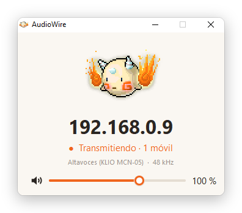

# AudioWire

English · **[Español](README.es.md)**

Stream the audio from your Windows or Linux PC to your Android phone over Wi-Fi.

## Usage

1. Open AudioWire on your PC.
   - **Windows:** when the firewall prompt appears, allow **private networks**.
   - **Linux:** make it executable with `chmod +x audiowire` and open it.
2. Install the APK on your phone (allow "unknown sources").
3. Open the app on your phone: it finds the PC on the network and connects by itself. If it does not find it, enter the IP address shown on the PC and tap **Conectar** (Connect).

If the connection drops, the phone reconnects on its own.

> The app interface is currently in Spanish.

## Requirements

- A Windows PC, or a Linux PC with GTK 3 and PulseAudio or PipeWire (Ubuntu 22.04, Debian 12, Fedora 35 or newer).
- An Android 7.0 or newer phone.
- Both devices on the same Wi-Fi network.
- UDP port 5005 allowed through the PC's firewall.

## Project structure

- `pc/` → Windows app in native C (Win32 + WASAPI), a single `.exe` with no dependencies.
- `linux/` → Linux app in C (GTK 3 + PulseAudio/PipeWire).
- `android/` → phone app, which plays the audio.
